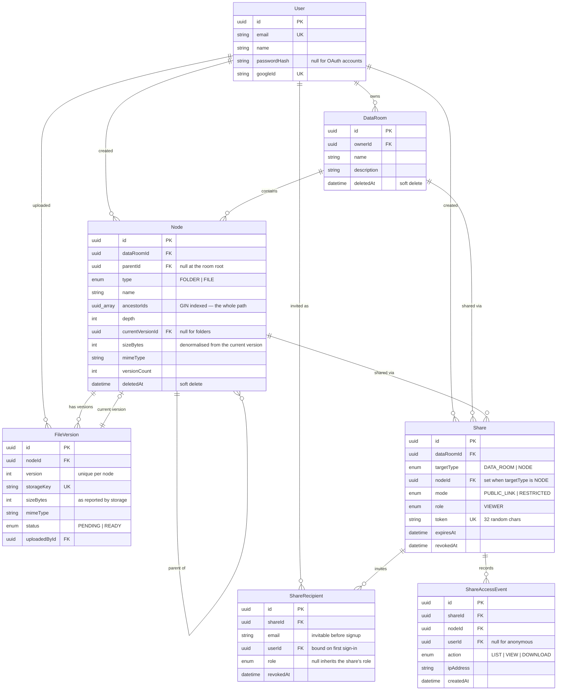

# Data Room

A virtual data room for due diligence: organise documents into nested folders, upload PDFs, and
share a room, a folder or a single file with read-only access — either through a public link or
with named people.

**Live app:** <https://tailoredtech.vercel.app> · **API + Swagger:**
<https://data-roomapi-production.up.railway.app/docs>

Demo accounts (created by `pnpm db:seed`):

| Account            | Password        | What they see                                  |
| ------------------ | --------------- | ---------------------------------------------- |
| `owner@acme.test`  | `datar00m-demo` | Owns two seeded data rooms with 29 documents   |
| `viewer@acme.test` | `datar00m-demo` | Nothing at all, until the owner shares with it |

The second account exists to make the sharing model easy to check: sign in as the owner in one
browser profile, share something with `viewer@acme.test`, and open it in another.

---

## Contents

- [Running it locally](#running-it-locally)
- [Design decisions](#design-decisions)
- [Data model](#data-model)
- [How it scales](#how-it-scales)
- [What is in the box](#what-is-in-the-box)
- [Security posture](#security-posture)
- [Testing](#testing)
- [Deployment](#deployment)
- [Where AI was used](#where-ai-was-used)
- [Trade-offs and what I would do next](#trade-offs-and-what-i-would-do-next)

---

## Running it locally

Requirements: Node 22+, pnpm 11+, Docker (for Postgres). **No cloud account is needed** — the app
ships a filesystem storage driver for development and switches to Supabase Storage when credentials
are present.

```bash
pnpm install
cp .env.example .env          # the defaults already point at the Docker database
docker compose up -d          # Postgres 17 on port 5433
pnpm db:migrate               # create the schema
pnpm db:seed                  # two accounts, two data rooms, 29 real PDFs
pnpm dev                      # web on :3000, API on :4000
```

Open <http://localhost:3000> and sign in as `owner@acme.test` / `datar00m-demo`.

| Command           | What it does                                        |
| ----------------- | --------------------------------------------------- |
| `pnpm dev`        | Runs the web app and the API together               |
| `pnpm build`      | Builds every package in dependency order            |
| `pnpm test`       | Unit tests (106 of them)                            |
| `pnpm typecheck`  | Typechecks every package                            |
| `pnpm lint`       | ESLint across the workspace                         |
| `pnpm db:migrate` | Creates and applies a migration                     |
| `pnpm db:seed`    | Resets the demo accounts and rebuilds their content |
| `pnpm db:studio`  | Prisma Studio                                       |

### Layout

```
apps/web        Next.js 16 · React 19 · Tailwind 4 · shadcn/ui · TanStack Query
apps/api        NestJS 11 · REST · Swagger at /docs
packages/db     Prisma 7 schema, migrations, generated client
packages/shared zod schemas and types — the contract between the two apps
```

---

## Design decisions

### One `Node` table for folders and files

Folders and files are rows in the same recursive table with a `type` discriminator, the way Drive
and Dropbox model it. The alternative — separate `Folder` and `File` tables — means two of
everything: two listing queries to merge and sort, two uniqueness rules, two move implementations,
two share targets, and two code paths that must not drift.

With one table, a folder listing is a single indexed query, name uniqueness is one index, and a
share points at one id whatever it happens to be. File payload lives in `FileVersion`, which
versioning needs anyway, and `Node.currentVersionId` points at the live one.

### Hierarchy as an array, not a recursive query

Every node stores `ancestorIds` — the full ordered chain from the root — with a GIN index. One
column answers the three questions that would otherwise need recursive CTEs:

| Question                                    | Query                                       |
| ------------------------------------------- | ------------------------------------------- |
| Everything inside this folder, at any depth | `ancestorIds @> ARRAY[folderId]`            |
| The breadcrumb trail                        | the array already **is** the path, in order |
| Does this share cover this node?            | `share.nodeId IN (node.id, ...ancestorIds)` |

The cost is that moving a folder must rewrite its descendants. That is one `UPDATE` — replace the
leading segment of each chain, keep the rest — and it is the single write-side price for making
every read cheap. [`node-tree.ts`](apps/api/src/nodes/node-tree.ts) holds the readable definition of
that rewrite, and its tests are what the SQL is checked against.

### File bytes never pass through the API

Uploads are two-phase:

```
1. POST …/files/init      → validates the name and type, reserves the row,
                            returns a signed URL
2. browser PUT → storage   → direct, with real progress events
3. POST …/complete         → the API asks storage how many bytes actually arrived,
                            then publishes the version
```

This is what makes per-file progress possible without routing megabytes through the API, and it
removes any body-size limit on uploads. It also means the API never takes the client's word for it:
the size recorded is the size storage reports.

A file whose bytes never arrive stays invisible — its node has no current version, and listings
filter those out — so a cancelled upload leaves nothing for anyone to trip over.

`fetch` cannot report upload progress in any current browser, so
[`xhr-upload.ts`](apps/web/src/lib/xhr-upload.ts) is the one place the app uses `XMLHttpRequest`.

### The web app proxies the API instead of calling it cross-origin

`next.config.ts` rewrites `/api/*` to the NestJS service. A cookie set by `api.example.com` on a
page served from `app.example.com` is a third-party cookie — Safari blocks those and Chrome is
phasing them out — so proxying keeps the session cookie first-party, `SameSite=Lax`, and removes
CORS from the picture entirely. The API stays independently deployed and publicly reachable; its
Swagger page is the proof.

The trade-off: the cookie is httpOnly and set through the proxy, so Next middleware cannot read it,
and route protection happens in the browser after one `/auth/me` call. That is a convenience gate —
the API authorises every request on its own, which is where it matters.

### Two storage drivers behind one interface

[`StorageService`](apps/api/src/storage/storage.service.ts) has a Supabase implementation for
production and a filesystem one for development. The local driver mints its own HMAC-signed,
expiring URLs, so it exercises exactly the same two-phase flow rather than a shortcut. The result is
that `git clone && pnpm dev` gives a fully working app — including openable PDFs from the seed —
with no cloud account at all.

### Errors carry a code, not just a status

Every deliberate failure returns `{ statusCode, code, message, details }` with a stable code from a
[shared enum](packages/shared/src/errors.ts). Status alone is not enough for good UX: a 409 from an
upload should open the "keep both / new version" dialog, while a 409 from a rename should highlight
the field with a suggested name. The frontend switches on the code, so error copy can change freely.

### PDF viewing uses the browser's own viewer

An `<iframe>` with a short-lived signed URL, not pdf.js. Every target browser already ships a PDF
reader with text selection, search, zoom and printing; embedding it costs nothing in bundle size and
nothing in worker configuration. There is a fallback for browsers configured to download PDFs
instead of displaying them.

### The cache is invalidated by what changed, not by what might have

Walking into a folder should not cost three requests, and renaming one file should not refresh the
whole room. Both follow from how the cache is keyed and swept:

- **Listings are invalidated per parent folder.** A change reports which folders it touched — a move
  reports both the folder it left and the one it joined — so sibling folders keep their cached rows.
  The blunt alternative, sweeping the room's whole key subtree, made every rename refetch every
  visited folder, both breadcrumb trails and each open file's version history.
- **Subtree totals are invalidated up the ancestor chain only.** Totals roll up, so a change inside
  `Legal/Contracts` makes those two and the room stale — and nothing else.
- **Breadcrumbs are computed, not fetched.** The sidebar already holds every folder with its parent,
  so the trail is a walk up that map. The endpoint remains the fallback for a cold load of a deep
  URL, where the tree has not arrived yet. [A test](apps/web/src/lib/folder-tree.spec.ts) pins the
  derived trail to the shape the API returns.
- **Folders are prefetched on hover and on focus.** Opening one usually renders from cache instead
  of flashing skeletons, and because the query options are [defined once](apps/web/src/lib/node-queries.ts)
  and shared by the hook and the prefetch, the two cannot warm different keys.

That the sweep is precise is the part worth testing, since getting it wrong shows stale data rather
than an error: [`node-cache.spec.ts`](apps/web/src/lib/node-cache.spec.ts) asserts against a real
query client which keys a change does and does not touch.

### Edge cases that shaped the code

| Case                                                 | Behaviour                                                                                                                  |
| ---------------------------------------------------- | -------------------------------------------------------------------------------------------------------------------------- |
| Uploading a file whose name is taken                 | A dialog offers "new version", "keep both" (`Report (2).pdf`) or "skip", and can apply the answer to the rest of the batch |
| Ten identical names dropped at once                  | The unique index rejects the losers of the race; the API re-resolves and retries, so every file lands                      |
| Renaming onto a taken name                           | 409 with a free name offered as a one-click fix                                                                            |
| Deleting a folder                                    | The confirmation states the folder count, file count, total size **and** how many share links will break                   |
| Deleting a folder someone is viewing through a share | Their next request returns 410 with "the shared item has been deleted", not a crash or an empty screen                     |
| Revoking a share while it is open                    | Next request is 403 with a distinct message; already-issued document URLs expire within a minute                           |
| A restricted link opened by the wrong account        | "You are signed in as X, which was not invited", with a way to switch accounts                                             |
| Moving a folder into its own subfolder               | Refused by the API and disabled in the picker, so it is not discovered by hitting an error                                 |
| A deleted name being reused                          | Allowed — the uniqueness index covers live rows only                                                                       |
| `Report.pdf` vs `report.pdf` in one folder           | Treated as a clash, because the difference is invisible to a reader                                                        |

---

## Data model



### Indexes that matter

| Index                                                     | Serves                                                                                          |
| --------------------------------------------------------- | ----------------------------------------------------------------------------------------------- |
| `Node (dataRoomId, parentId, deletedAt, type, name)`      | Default listing, folders first, and its keyset cursor                                           |
| … same prefix with `updatedAt` / `sizeBytes`              | The other two sort orders, still index-only                                                     |
| GIN on `Node (ancestorIds)`                               | Subtree size, counts, cascade delete, share containment                                         |
| GIN on `lower(Node.name)` with `gin_trgm_ops`             | Name search across a data room                                                                  |
| Partial unique on `(parentId, lower(name))` where live    | Two files cannot share a name in one folder                                                     |
| Partial unique on `(dataRoomId, lower(name))` at the root | Same rule where `parentId IS NULL`, which the above misses because SQL treats NULLs as distinct |

The last three cannot be expressed in Prisma's schema language and are written by hand in
[the initial migration](packages/db/prisma/migrations/).

---

## How it scales

### Computing the total size and item count of a folder, including its whole subtree

One query, no recursion:

```sql
SELECT type, count(*), sum("sizeBytes")
FROM "Node"
WHERE "dataRoomId" = $1 AND "deletedAt" IS NULL AND "ancestorIds" @> ARRAY[$2]::uuid[]
GROUP BY type;
```

Two properties make this cheap. `ancestorIds` with a GIN index turns "everything beneath this
folder" into an index lookup rather than a tree walk, so cost tracks the size of the answer and not
the depth of the tree. And `sizeBytes` is denormalised onto `Node` from the current version, so the
sum needs no join to `FileVersion` — that denormalisation is written in exactly one place, the
transaction that publishes a version.

**When that stops being enough**, the next step is cached rollups. `Node` gains
`subtreeSizeBytes` / `subtreeFileCount` on folders, maintained in the same transaction as the
mutation: `ancestorIds` already names every ancestor, so it is
`UPDATE "Node" SET "subtreeSizeBytes" = "subtreeSizeBytes" + $delta WHERE id = ANY($ancestorIds)` —
O(depth) writes, typically under ten rows, instead of an O(subtree) read on every page view. A move
applies the delta twice: subtracted from the old ancestor chain, added to the new one. Beyond that,
a `dirty` flag with background recomputation decouples the write path entirely.

I stopped at the single query because it is correct and fast at any size this project will see, and
because rollups are the kind of denormalisation that is wrong until it is measured.

### What changes when one data room holds 100,000 files

**Listing** is already cursor-paginated, not offset-paginated. `OFFSET 90000` makes Postgres walk
and discard 90,000 rows, and rows inserted while someone pages cause duplicates and gaps. The cursor
carries the last row's sort key, so each page is one index range scan:

```
(type, name, id) > (cursor.type, cursor.name, cursor.id)
```

expanded into the OR-chain Prisma can express ([`node-cursor.ts`](apps/api/src/nodes/node-cursor.ts)).
`type` always sorts ascending so folders stay grouped above files, and `id` breaks ties, which is
what makes the ordering total and therefore safe to paginate.

**Indexes**: three composite indexes share the prefix `(dataRoomId, parentId, deletedAt, type)` and
differ in their last column — `name`, `updatedAt`, `sizeBytes` — so every sort order the UI offers is
served by an index rather than a sort node.

**Search** uses a trigram GIN index on `lower(name)`. This is why the search endpoint is raw SQL:
Prisma's `contains` with `mode: 'insensitive'` emits `name ILIKE …`, which cannot use an index built
on an expression, and would degrade to a sequential scan over 100,000 rows.

**Still to do at that size**, in the order I would do it:

1. Virtualise the table rows in the browser. The API pages fine; the DOM is what struggles at a few
   thousand rendered rows.
2. Move cascade deletes and storage cleanup to a background job. Right now a delete soft-deletes the
   subtree in one statement — fine — but removes blobs inline, which is a long tail on a big folder.
3. Add the cached rollups described above, so folder totals stop being computed per render.
4. Partition or archive `ShareAccessEvent`, which is the only table that grows without bound.

### Extending sharing to per-user roles (viewer/editor) without remodelling

The model already carries roles. `Share.role` and the nullable `ShareRecipient.role` exist today, and
permission checks never compare roles directly — they ask
[`can(access, 'node:update')`](apps/api/src/shares/share-access.ts) against a capability map:

```ts
export const ROLE_CAPABILITIES: Record<ShareRoleValue, Capability[]> = {
  VIEWER: ['node:read', 'file:download'],
};
```

Adding an editor is one enum member in the schema and one line here:

```ts
  EDITOR: ['node:read', 'file:download', 'node:create', 'node:update'],
```

No table changes, no backfill, no migration of existing shares. `ShareRecipient.role` being nullable
means a single person can be promoted within an existing share — it falls back to the share's role
when unset — so "everyone can view, but Dana can also edit" needs no second share.

The enum has exactly one member today on purpose: the brief asks for read-only sharing, and a second
role in the enum with no implementation behind it would be a claim the app cannot honour.

---

## What is in the box

**Folders** — create, nest, rename, move, delete with the whole subtree; breadcrumb navigation that
collapses in the middle when it gets deep; a folder tree sidebar; sortable listing by name, size or
modified date.

**Files** — multi-file drag-and-drop upload with per-file progress, cancel and retry; PDF viewing in
the app; rename with conflict resolution; move by dialog or by dragging onto a folder or tree node;
delete.

**Sharing** — a data room, a folder or a single file; public links and named invitations side by
side; per-person removal; revoke everything at once; a read-only viewer that shows only what the
share covers, with breadcrumbs that never reveal the folders above it.

**Extra credit, both done** — search by name across a data room (trigram-indexed, ⌘K), and file
versioning on name conflict with a version history you can download older revisions from.

**Beyond the brief** — an access audit trail (who opened or downloaded what, and when), moving
folders as well as files, drag-and-drop moves, a "shared with you" list so recipients are not
dependent on keeping the email, dark mode, and a local storage driver so the project runs with no
cloud account.

---

## Security posture

What is in place, and where I know the gaps are.

**Access control.** Authentication is on by default — a global guard rejects anything not
explicitly marked `@Public()`, of which there are ten: sign-up, sign-in, sign-out, the health
check, the four token-addressed share routes and the two local-storage routes. Every owner route
resolves ownership through the data room, and a room belonging to someone else answers **404, not
403**, so the API never confirms that an id exists to someone who cannot see it. The share resolver
is the file with the most test coverage in the project for that reason.

**Credentials and sessions.** Argon2id at its recommended parameters. A sign-in attempt for an
unknown address spends comparable time to a real one, so the endpoint cannot be used to discover
which addresses have accounts. The session is a JWT in an httpOnly, `SameSite=Lax`, `Secure`
cookie, first-party thanks to the proxy. Sign-in is rate limited to 10 attempts a minute per
address and sign-up to 5; everything else gets a generous 300.

**Documents.** The bucket is private and the service-role key never leaves the server; the browser
only ever receives signed URLs that live 60 seconds, which is also what makes revoking a share take
effect quickly. Share tokens are 24 bytes of `randomBytes`. An upload is only published after the
API asks storage how many bytes actually arrived **and** confirms the stored object really is a PDF
— extension and browser-reported MIME type are both the client's word for it, so neither is
trusted on its own. `helmet` sets `nosniff`, a CSP and frame options on every response, which
matters most for the local driver, since that one serves uploaded files from the app's own origin.

**The database's own surface.** Row level security is deliberately off: the API is the
authorisation boundary, it connects as the owning role, and every query already runs through the
access resolver, so RLS policies would duplicate that logic in a second place where it could drift.
That is only safe because nothing else can reach the tables. Supabase also fronts the `public`
schema with a REST API, which this app never uses — and its anonymous role holds no `SELECT`,
`INSERT`, `UPDATE` or `DELETE` on Prisma-created tables, so the publishable key cannot read a row
even though no policy forbids it. If the tables were ever exposed to that API on purpose, RLS would
have to come with them.

**Injection and XSS.** Three raw SQL statements, all parameterised through tagged templates; the
`Unsafe` variants of Prisma's raw API are not used anywhere. No `dangerouslySetInnerHTML`, no
`eval`. Every request body and query string is parsed by a zod schema, which drops unknown keys.

### Known gaps

**Email addresses are not verified, and restricted shares are addressed by email.** This is the
one I would fix first. Access can be granted to an address before that person has an account —
which is the feature — but nothing proves the person who later registers with that address owns it.
Someone who knows a colleague's work address could register it and receive a share intended for
them. The fix is to verify the address before invitations take effect, or to deliver invitations as
one-time links to the address itself; both need an email provider, which felt like the wrong thing
to add to a take-home. Until then, treat a restricted share as "only as trustworthy as your
knowledge of who controls that mailbox".

**Sessions cannot be revoked.** Signing out clears the cookie, but a token that has already been
copied stays valid for its seven days. A `tokenVersion` column checked by the guard would fix it at
the cost of one query per request.

**No CSRF token.** `SameSite=Lax` means a cross-site POST does not carry the cookie, and no
state-changing route responds to GET, so the practical exposure is small — but a token would be the
belt to that pair of braces.

**Sign-up reveals whether an address is already registered.** A deliberate trade: the alternative
is telling someone their account was created when it was not.

**Operationally:** creating the Supabase bucket as _public_ rather than private would make every
document readable by URL forever, bypassing shares and revocation entirely. It is the single most
damaging misconfiguration available here, which is why [`DEPLOYMENT.md`](DEPLOYMENT.md) calls it out
in the step itself.

## Testing

```bash
pnpm test        # 106 unit tests
```

The tests concentrate on the pure logic where a mistake is both easy to make and expensive:

- [`share-access.spec.ts`](apps/api/src/shares/share-access.spec.ts) — the full matrix of
  public/restricted × anonymous/invited/uninvited × revoked/expired/deleted, plus share containment.
  This is the file where a bug means someone reads a document they should not.
- [`node-tree.spec.ts`](apps/api/src/nodes/node-tree.spec.ts) — move legality, including the cycle
  that would detach a branch from the tree, and the ancestor rewrite that the move SQL implements.
- [`node-cursor.spec.ts`](apps/api/src/nodes/node-cursor.spec.ts) — keyset pagination, in all three
  sort orders and both directions.
- [`naming.spec.ts`](packages/shared/src/naming.spec.ts) — conflict resolution and name validation.
- [`node-cache.spec.ts`](apps/web/src/lib/node-cache.spec.ts) and
  [`folder-tree.spec.ts`](apps/web/src/lib/folder-tree.spec.ts) — which cache keys a change
  invalidates, and the breadcrumb trail derived from the folder tree. Both fail quietly rather than
  loudly: the symptom is stale or wrong data on screen, not an exception.

The HTTP surface was verified end to end with scripted runs against a live server — 29 assertions
for folders and listing, 38 for uploads, versioning and upload-content checks, 41 for sharing —
covering the edge cases in the table above. Those scripts drove development rather than being kept as a suite; the honest
statement is that this project has thorough unit tests and no automated end-to-end suite. Given more
time, Playwright covering "upload, share, revoke, confirm the recipient is locked out" would be the
first thing I would add, because that path crosses every layer.

---

## Deployment

Step-by-step instructions, with the exact values to copy and an end-to-end checklist, are in
[`DEPLOYMENT.md`](DEPLOYMENT.md). In summary:

Both halves deploy independently.

**API → Railway.** [`railway.json`](railway.json) points at [`apps/api/Dockerfile`](apps/api/Dockerfile),
runs `prisma migrate deploy` as a pre-deploy step, and health-checks `/health` — which touches the
database, so a process that is up but cannot reach Postgres is correctly reported as unhealthy.

**Web → Vercel.** Project root is `apps/web`, where Vercel finds `next` in the manifest;
[`apps/web/vercel.json`](apps/web/vercel.json) then builds from the repository root through
Turborepo, so the shared package is compiled before Next needs it.

**Database and storage → Supabase.** Create a project and a **private** bucket named
`data-room-files`. Setting `SUPABASE_URL` and `SUPABASE_SERVICE_ROLE_KEY` switches the storage driver
automatically; without them the app uses the filesystem driver.

Environment variables are documented one by one in [`.env.example`](.env.example). Two are worth
calling out:

- `DATABASE_URL` should be the **pooled** Supabase connection (port 6543) and `DIRECT_URL` the
  **direct** one (5432). Migrations create a shadow database and take advisory locks, neither of
  which survives a transaction pooler.
- `API_ORIGIN` on Vercel must be the Railway URL. It is a server-side variable, not `NEXT_PUBLIC_`,
  because it is only ever used by the rewrite.

---

## Where AI was used

I wrote this project with Claude Code, and used it throughout rather than for isolated pieces. What
that looked like in practice:

- **Scaffolding and boilerplate.** Module wiring, the shadcn component set, DTO plumbing, the Prisma
  schema's first draft — the parts where typing speed was the only bottleneck.
- **API surface verification.** The three scripted test runs mentioned above were generated and
  iterated on quickly. This was the highest-value use: it turned "I think delete cascades correctly"
  into 108 assertions run against a live server, and it caught real bugs — the email schema
  rejecting `" user@acme.test "` because zod validates before transforming, and a `tsc` `incremental`
  build silently producing a `dist` with missing files after Nest wiped the output directory.
- **Checking library facts instead of trusting recall.** Prisma 7 moved connection URLs out of
  `schema.prisma` into `prisma.config.ts`, the shadcn CLI replaced `--base-color` with presets, and
  lucide v1 renamed `Loader2`. Each was confirmed against current documentation or the installed
  package's own typings before writing code, not after the build failed.
- **Prose.** This README and the code comments were drafted with AI and then edited down — the
  reasoning in them is mine; the first draft usually was not.

What I did not delegate: the data model, the decision to make `ancestorIds` the backbone of the
whole design, the two-phase upload, the proxy-instead-of-CORS call, and the shape of the sharing
permission model. Those are the decisions the rest of the code follows from, and they are the ones
worth being able to defend.

Nor the review, which turned out to matter more than the drafting. A preview panel that was tiny and
stretched at the same time, row actions that opened the file's info sheet behind their own dialog,
and a version list that only ever showed one entry were all found by using the app — no test caught
any of them. The same goes for the scope calls: email verification is documented as a known gap
rather than half-built, and the caching work above started as "why does walking into a folder reload
everything". Reading the output critically is the part that does not transfer.

---

## Trade-offs and what I would do next

**Deliberately left out.** Google OAuth — the brief allows either, and email/password made the
sharing model far easier for a reviewer to exercise with two accounts. Non-PDF file types — the
brief says PDF is enough, and an accept-list keeps the viewer honest, since every accepted type is
one the app can actually render. A trash/restore flow — deletes are soft in the database for
referential and audit reasons, but the blobs are removed immediately, so "undo" would be a promise
the storage layer cannot keep.

**Known rough edges.** A pending upload holds its name until it completes or is cancelled; an
abandoned browser tab leaves that reservation until a sweeper clears it, which is written about but
not implemented. The signed download URL lives 60 seconds, so a PDF left open for a long time will
not survive a page reload without re-fetching — the trade for revocation taking effect quickly. The
`ShareAccessEvent` table grows without bound.

**Next, in order.** The Playwright suite described above; virtualised table rows; background jobs
for blob cleanup and the stale-upload sweep; then the cached subtree rollups, once there is a
workload that justifies them.
